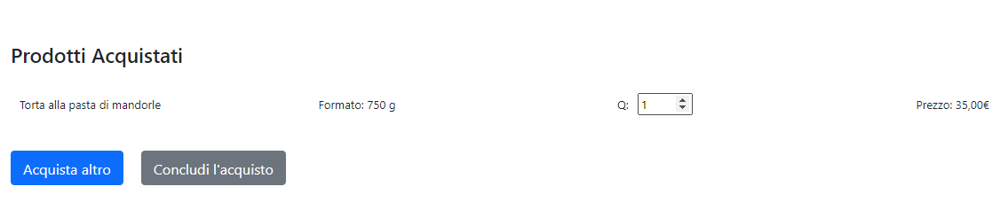
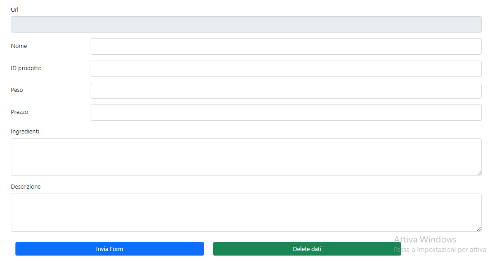

<h1 algin="center">2° Progetto Angular: e-commerce</h1>

  
Sommario

  <ol>
    <li>
      <a href="#informazioni-sul-progetto">Informazioni sul progetto</a>
      <ul>
        <li><a href="#costruito-con">Costruito con</a></li>
      </ul>
    </li>
   <li><a href="#descrizione">Descrizione</a>
     <ul>
        <li><a href="#struttura-repository">Struttura Repository</a></li>
        <li><a href="#Download-e-testare-app-in-locale">Download e testare app in locale</a></li>
      </ul>
    </li>
   <li><a href="#licenza">Licenza</a></li>
  <ol>

<!-- Informazioni sul progetto-->

## Informazioni sul progetto

La finalità di questo progetto è quella di sviluppare un sito di e-commerce con il framework Angular e l'utilzzo del database di <b>Firebase</b>.
Non sono state utilizzate API esterne.

Durante la realizzazione di questo prgetto si è supposto che si stava realizzando un e-commerce per un'attività artigianale che realizza dolci per esempio una pasticceria.

L'applicazione è stata deployata su Firebase:
- <h4>Link Firebase: (https://progetto2-angular.web.app/)</h4>

#### <h3>Costruito con:</h3>

<b>Framework</b>:

- [Angular] (https://angular.io/)
- [Bootstrap] (https://getbootstrap.com/)

<b>Libreria</b>

- [Bootstrap Icons] (https://icons.getbootstrap.com/)

<b>Database</b>
  
  --Database Firebase     
   <ul>
     <li>Firestore Database</li>
     <li>Realtime Database</li>
     <li>Storage</li>
 </ul>
<!--Descrizione-->

## Descrizione

### Struttura Repository

<h4>Cartella img-README</h4>
Contiene le immagini presenti nel README.md

<h4>Cartella src</h4>

  
Cartella src

   <ol>
     <li>
      Cartella app: contiene i file dei componenti in cui sono definiti la logica e i dati dell'applicazione.
      Componenti, modelli e stili angolari vanno qui.
      Per esempio:
      <ol>
        <li>
          app/app.componets.ts: Definisce la logica del componente radice dell'applicazione, denominato AppComponent.
          La vista associata a questo componente radice diventa la radice della gerarchia della vista quando si aggiungono componenti e servizi all'applicazione.
        </li>
        <li>app/app.component.html definisce il modello HTML associato all'AppComponent radice.</li>
        <li>app/app.component.css definisce il foglio di stile CSS di base per L'AppComponent radice.</li>
        <li>app/app.component.spec.ts definisce uno unit test per l'AppComponent radice.</li>
        <li> app/app.module.ts definisce il modulo radice, denominato AppModule, che indica ad Angular come assemblare l'applicazione. 
              Man mano che si aggiungono altri componenti all'app, questi devono essere dichiarati qui.
        </li>
     </ol>
  </li>
   
  <li>Cartella assets: contiene immagini e altri file di risorse da copiare cosi come sono quando crei l'applicazione.</li>
   
  <li>
     Cartella environments: contiene le opzioni di configurazione della build per particolari ambienti di destinazione.
     In particolare nella cartella environments sono presenti:
      -- environments.ts (che viene utilizzato in fase di sviluppo);
      -- environments.prod.ts (che viene utilizzato in fase di produzione);
       
    In questi due file è stata inserita la configurazione Firebase dell'app web.
      
   
  </li>
   <li>Altri file come:
     <ol>
       <li>
         favicon.ico: un'icona che viene utilizzata per questa applicazione alla sinistra dell'URL nella barra degli indirizzi del browser.
       </li>
       <li>index.html: La pagina HTML principale che viene publicata quando qualcuno visita l'app.</li>
       <li> 
         test.ts: Il punto di ingresso principale per i tuoi unit test, con alcune configurazioni specifiche   di Angular.
       </li>
     </ol>
   </li>
 <ol>

- La cartella "src" contiene i file di origine per il progetto dell'applicazione a livello di root.

<h4>File di configurazione dell'applicazione</h4>

I file di configurazione specifici dell'applicazione, per l'applicazione root risiedono a livello di root dell'area di lavoro.
Per esempio:
<ol>
 <li>Karma.conf.js: configurazione carma specifica per l'applicazione</li>
 <li>
   tsconfig.app.json: configurazione TypeScript specifica per l'applicazione, incluse le opzioni del compilatore di modelli TypeScript e Angular
 </li>
 <li>
   tsconfig.spec.json: configurazione TypeScript per i test dell'applicazione.
 </li>
 <li>tslint.json: Configurazione TSLint specifica per l'applicazione</li>
</ol>

### Funzionalità dell'applicazione

<b>HomePage</b>
  
 HomePage dell'e-commerce rappresenta la vetrina online dell'attivita.
      
La <b>HomePage</b> è costituita da due parti:
     
  -- <b>Barra di navigazione</b> in alto nella quale sono presenti 
    i pulsanti "Checkout" e "Aggiungi Prodotto".
   
   
  &emsp;&emsp; 
     
    Il pulsante "Checkout" che porta al carrello dei prodotti. Il pulsante "Aggiungi Prodotto" permette a chi amministra l'e-commerce di inserire altri prodotti destinati alla       vendità.
   
   
 -- <b>Galleria dei prodotti</b>
    
    
   &emsp;&emsp; 
   
   
   In ogni card è presente il pulsante per aggiungere il prodotto direttamente al carrello. 
   Cliccando sul nome del prodotto si viene indirizzati alla pagina di dettaglio del prodotto. 
    
   (folder: main-page)

  <b>Pagina dettaglio prodotto</b>
 
  &emsp;&emsp; 
 
 Come si osserva dall'immagine nella pagina di dettaglio è presenta la barra di ricerca prodotto in alto. Anche dalla pagina di dettaglio si puo procedere all'inserimento del   prodotto nel carrello per l'acquisto.
 
(folder: detail-page-description)
 
 

<b>Barra di ricerca</b>
 
&emsp;&emsp; 
 

Cliccando sulla barra di ricerca si apre una tendina dove vengono riportati tutti i prodotti in vendita .
Scegliendo un prodotto, e premendo il pulsante "Search" si viene reindirizzati alla pagina di dettaglio del prodotto.
 
(folder: search-bar)
 
 
<b>Carrello</b>
 
 &emsp;&emsp;&emsp;&emsp; 
  
 Come si osserva nel carrello è presente la voce "Q" che rappresenta il numero dei prodotti da acquistare. 
 Il pulsante "Concludi l'aquisto" per il momento non ha nessuna funzione ad esso collegata.
  
(folder: cart)
 
 
<b>Form: aggiungi prodotto</b>
 
&emsp;&emsp;&emsp;&emsp; 
&emsp;&emsp; 
 
 Come si osserva il Form è suddiviso in due parti. 
 Bisogna prima caricare l'immagine e premere "Invio", in questo modo il campo "Url" del secondo form si compilerà in automatico. Una volta che l'immagine è stata caricata, compilare la seconda parte del Form in tutte le sue parti e premere "Invia Form".
 Sè il form non viene compilato in tutte le sue parti o non viene caricata prima l'immagine, compare il messaggio di errore e il form non viene inviato.
 Con il pulsante "Delete immagine" si viene reindirizzati all'elenco dell'immagini caricate nello Storage di Firebase nel quale si può procedere a cancellare ciascuna immagine presente nel database. 
Nel secondo form con il pulsante "Delete dati" si accede all'elenco dei prodotti caricati in "Firestore Database" anche in esso si può procedere a cancellare ciscun prodotto.
 
 
  
(
 folder:uploads ;
 folder:delete_data; 
 folder: delete_img;
)
 
### Download e testare app in locale

- Sul proprio dispositivo è necessario installare: 
   - Nodo.js
   - gestore di pachetti npm. 
Le applicazioni Angular, Angular CLI e Angular dipendono dai pachetti npm per molte caratteristiche e funzioni.

L'app può essere testata in locale eseguendo i seguenti passaggi:

- Clonare il repository del progetto in locale 

- Installare le "dependencies" e "devDependencies" che sono riportate nel file package.json tramite il comando :
  
  npm install <dependencies o devDependencies>
  
   
  

  

- Testare l'app in locale tramite il comando ng serve.
Il comando "ng serve" crea e serve l'app, ricostruendola in base alle modifiche ai file .
Una volta che l'app è stata creata e servita andare al seguente link <a>http://localhost:4200/**</a> oppure cliccare sul link riportato nel terminale, vedere immagine seguente.

 

## Licenza

    Distribuito con licenza MIT. Vedere "LICENSE" per ulteriori informazioni.

